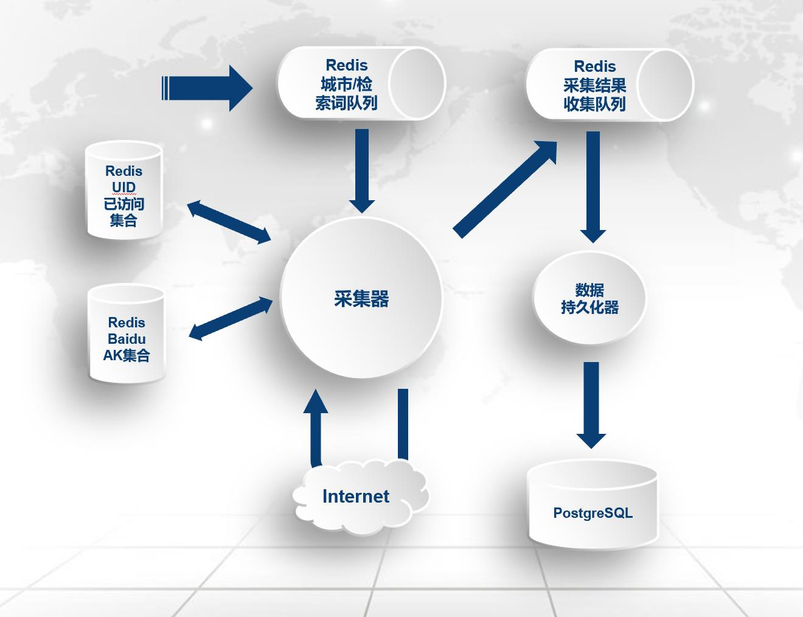

## 位置信息服务--POI采集器
> 本工具仅用来采集公开合法数据，严格遵守获取数据的接口的协议规范

#### 简介
> 采集百度LBS接口数据，包含POI的名称、POI类型、经纬度、部分包含电子围栏（AOI）等信息，作为参考性指标以辅助建模，提供更多的特征维度。不直接用于任何产品输出。

#### 流程设计


#### 使用说明
1. 打开start.sh
1. 修改`use_prov`,可以指定省份(参考注释`参数1`的省份名称),也可以指定"全国"
1. 修改`query`,设置搜索关键字(可以是POI分类或任意关键字),例如`5A景区`、`高等院校`
1. ./start.sh
1. python Monitor.py 查看任务执行情况

#### 文件描述

脚本名称|脚本描述
:-:|:-:
AKManager.py  |  百度AK统一管理维护，每日8点自动更新（已配置crontab）
DBManager.py  | 数据库统一资源池管理工具
GisTransformer.py|  包含坐标系转换工具
Persist.py    | 持久化数据到PostgreSQL(在GPU228 Tmux中启动,属于常驻进程)
PushRegion.py | 推送用户派发的任务到队列的程序
PushVisitStatus.py | 同步postgresql-redis的uid已访问集合
Spider.py |     主采集程序(在Tmux中启动,属于常驻进程)
start.sh   |    用户派发任务的入口

执行方式
```
python AKManager.py 0  #重置AK集合
python AKManager.py 1  #查看集合剩余AK数量
python AKManager.py 2  #查看集合剩余AK明细
python PushVisitStatus.py # 数据库与redis缓存同步uid已访问集合
python Spider.py  # 主采集程序
python Monitor.py #队列监控器
./start.sh # 任务派发入口
```

#### POI 分类体系（含采集状态）
> 不保证数据全面性，建议使用GeoX-高级工具-POI/AOI核验后自行补充缺失部分 

一级行业分类|	二级行业分类
:-|:-
美食|中餐厅、外国餐厅、小吃快餐店、蛋糕甜品店、咖啡厅、茶座、酒吧
酒店|星级酒店、快捷酒店、公寓式酒店
购物|购物中心、百货商场、超市、便利店、家居建材、家电数码、商铺、集市
生活服务|通讯营业厅、邮局、物流公司、售票处、洗衣店、图文快印店、照相馆、房产中介机构、公用事业、维修点、家政服务、殡葬服务、彩票销售点、宠物服务、报刊亭、公共厕所
丽人|美容、美发、美甲、美体
旅游景点|公园、动物园、植物园、游乐园、博物馆、水族馆、海滨浴场、文物古迹、教堂、风景区
休闲娱乐|度假村、农家院、电影院、KTV、剧院、歌舞厅、网吧、游戏场所、洗浴按摩、休闲广场
运动健身|体育场馆、极限运动场所、健身中心
教育培训|高等院校、中学、小学、幼儿园、成人教育、亲子教育、特殊教育学校、留学中介机构、科研机构、培训机构、图书馆、科技馆
文化传媒|新闻出版、广播电视、艺术团体、美术馆、展览馆、文化宫
医疗|综合医院、专科医院、诊所、药店、体检机构、疗养院、急救中心、疾控中心
汽车服务|汽车销售、汽车维修、汽车美容、汽车配件、汽车租赁、汽车检测场
交通设施|飞机场、火车站、地铁站、地铁线路、长途汽车站、公交车站、公交线路、港口、停车场、加油加气站、服务区、收费站、桥、充电站、路侧停车位
金融|银行、ATM、信用社、投资理财、典当行
房地产|写字楼、住宅区、宿舍、内部楼栋
公司企业|公司、园区、农林园艺、厂矿
政府机构|中央机构、各级政府、行政单位、公检法机构、涉外机构、党派团体、福利机构、政治教育机构
出入口|高速公路出口、高速公路入口、机场出口、机场入口、车站出口、车站入口、门（备注：建筑物和建筑物群的门）、停车场出入口
自然地物|岛屿、山峰、水系

#### 已扫描关键字及城市
* 全国：旅游景点、交通设施、地铁站
* 北京市：高等院校、中学、小学、百货商场、购物中心、**公司企业**、**休闲娱乐**、专科医院、综合医院、幼儿园、培训机构、科研机构、写字楼、内部楼栋、健身中心、体育场馆、文化宫、美术馆、家居建材、图书馆、便利店、超市


#### 存储表字段
> 数据库访问位置位于 `XX.XX.XX.XXX : psql logs ; \d poi`  

> 加粗部分表示该字段不可空

中文释义|字段名|备注
:-:|:-:|:-:
唯一标识|**uid**|
名称|**name**|POI名称来源于百度,非官方名称
类型标签| **tag** |大类;小类
属性|attribute|描述POI标签信息,比如AAAAA景区;985高校;三甲医院等,分号分隔
栅格| **geohash**|8位
省份| **province**|
城市| **area** |
区县| **district** |
AOI围栏| aoi | postgis-POLYGON类型
POI经纬度| **poi** | postgis-POINT类型
电话号码|telephone|

